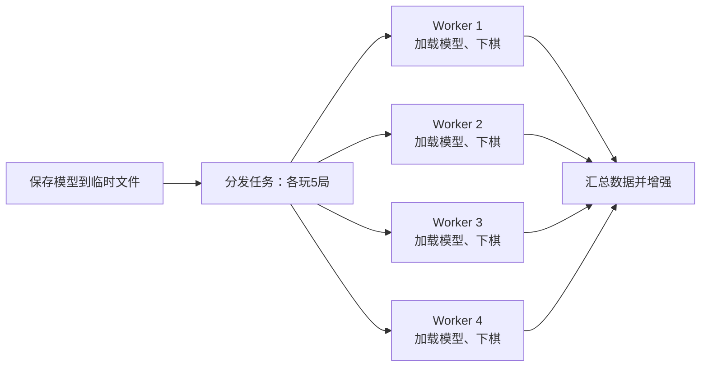

# 五子棋 AI 项目报告

> 林函锋 | 525021910285 | serendipity_lin@sjtu.edu.cn

> [水源文档地址](https://notes.sjtu.edu.cn/s/bfbugPVxa)

## 项目文件结构

下面列出最终项目结构，并标注了相对于原始仓库**新增**和**修改**的文件。

```text
Gomoku-AI/
├── AlphaZero/
│   ├── __init__.py
│   ├── mcts_alphaZero.py             # 修改：评估时改为 argmax 选最优先验动作
│   ├── mcts_pure.py                  # 修改：棋盘复制改用 Board.copy()
│   └── policy_value_net_torch.py     # 修改：新增 AMP、torch.compile 支持，修复 compile 后模型保存
├── Board/
│   ├── GUI_v1_4.py
│   ├── __init__.py
│   └── game_board.py                 # 修改：新增 Board.copy() 快速拷贝棋盘状态
├── Minimax/
│   ├── AIController.cpp              # 新增：Minimax AI 实现
│   ├── AIController.h
│   ├── AIController_logic.md
│   ├── baseline.cpp
│   ├── evaluate.py                   # 修改：多进程快速评测，主线程顺序输出每局结果
│   ├── judge.py
│   ├── sample.cpp
│   └── search_wrapper.py
├── model/
│   ├── 11_11_5.pt
│   ├── 3_3_3.model
│   ├── 5_5_4_baseline/               # 新增：5×5 baseline 模型与训练日志
│   ├── 5_5_4_block2_600/             # 新增：最终 5×5 优化模型与训练日志
│   ├── 5_5_4_optimized/              # 新增：5×5 中间优化模型与训练日志
│   └── best_policy.model             # 生成：train.py 训练井字棋保存的最优模型
├── tensorflow/
│   └── ...
├── evaluate_5_5_4.py                 # 新增：5×5 模型评测脚本
├── human_play.py                     # 修改：支持命令行参数，可加载不同棋盘/模型对战
├── plot_results.py                   # 新增：训练日志曲线绘制工具
├── report.md
├── requirements.txt                  # 修改：依赖版本说明
├── train_5_5_4_block2_600.sh         # 新增：当前使用的 5×5 训练脚本
├── train.py                          # 修改：修复 PyTorch 模型文件存在性判断
└── train_5_5_4.py                    # 新增：5×5 四子棋 AlphaZero 训练入口
```

---

## 1. 本地运行环境

- 运行操作系统：WSL2（Ubuntu 22.04）
- CPU：AMD Ryzen 9 9955HX （16 核 32 线程）
- GPU：NVIDIA GeForce RTX 5070 Laptop（Blackwell sm_120； PyTorch 2.12.0 nightly + CUDA 12.8）
- Python 环境：Conda，Python 3.10.20
- C++ 编译器：g++（GCC 11+）

---

## 2. Minimax Search AI

### 2.1 实现思路

Minimax Search AI 的初始实现效果较差，分析后发现，主要问题在于棋盘状态维护访问时间复杂度高、候选集未排序平等看待和搜索框架的效率与正确性不足。因此后续实现没有继续从头硬写，而是借鉴了 baseline 的基础代码，保留其核心设计，并针对开局搜索、置换表、时间控制和随机性等方面进行改进。

### 2.2 继承的 baseline 核心设计与改进

#### 以下设计直接沿用 baseline 的实现：

- `Status` 增量状态维护：对每个坐标、每个方向、每种颜色维护连续子数与两端是否为空。落子或提子时仅更新受影响区域，使任意空点的威胁值可在 `O(1)` 内查询。
- `std::set<Blank>` 候选集：空点按 `max(我方威胁, 对方威胁)` 降序排列，为搜索提供高质量的优先顺序。
- Minimax + Alpha-Beta 搜索框架：采用 `solve(color, depth, width, low, high)` 的结构与标准窗口传递。
- 评估权重表：成五 / 活四 / 冲四 / 活三 / 眠三的层级权重设计。

#### 主要改进点：

#### （1）加深开局搜索

baseline 的 `first_two_black()` 与 `second()` 仅搜索 6 层，且遍历全部 225 个空点，搜索质量有限。改进后：

- 仅评估威胁最大的前 40 个候选（`top_empty(40)`）；
- 使用与中盘相同的完整深度 `DEPTH = 14` 评估每个候选。

该决策方式显著提升了开局时的决策质量。改进前后的 64 局对比如下：

| 版本 | AIController 胜 | baseline 胜 | score |
|------|-----------------|-------------|-------|
| 早期自行实现 | 22 | 42 | -0.31 |
| baseline 原版 | - | - | 0 |
| 改进开局搜索后 | 49 | 15 | +0.53 |

#### （2）加入置换表

实现了 Zobrist 哈希与置换表（TT）。TT 大小为 `2^20` 项，存储 `[key, depth, score, flag, best_move]`，同 key 保留深度更大者。

在没有 TT 的情况下，14 层搜索在中盘容易超时；加入 TT 后，重复局面得以复用，大多数局面可在 4.4 秒内完成搜索。（4.4s 是因为在检测的时候发现由于某一步搜索较长，计时器的最大延迟在 0.5s 上下，所以用 4.4s 框定极限，能够稳定不超时）

#### （3）迭代加深与时间控制

中盘 `turn()` 不再固定搜索 14 层，而是采用迭代加深：从深度 2 开始，每次增加 2 层，每完成一层保留当前最佳着法。当时间接近 4.4 秒上限时，返回最近完成深度的结果，避免超时判负。

```cpp
Coordinate best = solve(0, 2, WIDTH).coor;
for (int d = 4; d <= DEPTH && !out_of_time(); d += 2) {
    best = solve(0, d, WIDTH).coor;
}
```

#### （4）中心随机开局

baseline 原版的黑第一手在 `[4,10]×[4,10]` 随机，现改为在中心 3×3 区域随机选择：

```cpp
{(6,6), (6,7), (6,8), (7,6), (7,7), (7,8), (8,6), (8,7), (8,8)}
```

该改动同时满足 先手第一手落在中心 7×7 范围内 和 引入非确定性，避免对局重复。

实测在其余代码不变时，固定 `(7,7)` 开局时胜率约 50% 且波动较大，改为 9 点随机后胜率稳定在 75% 以上。

### 2.3 评估搜索与 swap 处理

#### 评估与状态传递

评估的分数权重沿用 baseline 的权重表，对每个空点四个方向的威胁值求和。搜索为带 TT 的 Minimax，窗口传递如下：

```cpp
tmp -= solve(color ^ 1, k - 1, width, tmp - high, tmp - low, new_key).w;
```

TT 存储精确分、下界和上界三种 flag，仅当满足剪枝条件时直接返回。

开局阶段根据 `turnID` 与 `ai_side` 调用不同策略函数，以处理换手的情况：

- 用**随机函数**抽取一个点作为黑第一手
- `first_two_black()`：黑第二手。对每个候选点假设黑下于此，计算白方（含 swap 选项）的最佳优势 `abs(solve(opp).w)`，选择该值最小的点。
- `second()`：白第一手。选择使局面最“失衡”的点，以利于后续 swap 决策。
- `is_change()`：白第二手。若 `solve(self).w > 0` 则继续下，否则返回 `(-1,-1)` 表示 swap。

#### 关键参数

```cpp
const int DEPTH = 14;              // 中盘最大搜索深度
const int FIRST_THREE_DEPTH = 10;  // 开局辅助搜索深度
const int WIDTH[DEPTH + 1] =
    {0, 0, 3, 3, 3, 3, 3, 4, 4, 5, 6, 7, 9, 11, 13};
const int FIRST_THREE_WIDTH[FIRST_THREE_DEPTH + 1] = 
    {0, 0, 3, 3, 4, 5, 5, 7, 9, 11, 13};

// 威胁权重表：WEIGHT[len-1][open_flag]
// open_flag = 0 表示两端都空；open_flag = 1 表示恰好一端空
const ll WEIGHT[4][2] = {
    {3, 1},
    {1000, 3},
    {1000000, 1000},
    {10000000000ll, 1000000}
};
```

#### 对 `evaluate.py` 的纠正

文件中的下述函数会把代表 swap 的输入 `(-1, -1)` 处理成非法输入
```python
def receive_as_action(proc: subprocess.Popen) -> tuple[int, int] | None:    # None denotes output error
    value = receive(proc).split(' ')
    if len(value) != 2:
        return None
    if not value[0].isdigit() or not value[1].isdigit():
        return None
    return int(value[0]), int(value[1])
```

已修改为：
```python
def receive_as_action(proc: subprocess.Popen) -> tuple[int, int] | None:    # None denotes output error
    value = receive(proc).split(' ')
    if len(value) != 2:
        return None
    try:
        return int(value[0]), int(value[1])
    except ValueError:
        return None
```

### 2.4 对战 baseline 结果

#### 创新修改

提交的 `evaluate.py` 已经改为多线程同步测评，可以用 `--num-workers xx` 控制使用的 CPU 核数，以提高测评效率

#### 实际效果

使用 `python evaluate.py --agents-path ./baseline ./AIController --num-plays 1000 --num-workers 12` 评测的结果：（总花费时间实测约25分钟）

```
2026-07-16 23:39:32,509 INFO worker.py:2024 -- Started a local Ray instance.
************ Summary ************
num plays: 1000
Agent ./baseline:
score = -0.644 | wins = 178
Agent ./AIController:
score = 0.644 | wins = 822
```

可以看到 AIController 已能较为稳定击败 baseline，胜率约 82%。

---

## 3. AlphaZero AI（Option.1 部分）

### 3.1 对纯 MCTS 的理解

纯 MCTS 的核心流程为 selection → expansion → simulation → backup：
- Selection：从根节点出发，按 `Q + u` 选择子节点，直到到达叶子节点。
- Expansion：用均匀策略为叶子节点扩展所有合法动作。
- Simulation：从叶子节点开始随机落子，直到棋局结束。
- Backup：将模拟结果反向传播到路径上的所有节点。

UCT 公式为：
```
u = c_puct * P * sqrt(N) / (1 + n)
value = Q + u
```

其中 `P` 是先验概率，`N` 是父节点访问次数，`n` 是当前节点访问次数。

### 3.2 对策略价值网络的理解

网络结构为双头 ResNet：
```
输入：[B, 9, H, W]（8 层历史特征 + 1 层当前玩家颜色）
  ↓ ZeroPad2d(2)
  ↓ Conv2d(9→64, 1×1)
  ↓ ResBlock × nb_block
  ├── Action Head ──→ Conv2d(64→2, 1×1) → BN+ReLU → Flatten → Dense → log_softmax
  └── Value Head ──→ Conv2d(64→1, 1×1) → BN+ReLU → Flatten → Dense(256) → ReLU → Dense(1) → tanh
```

残差块内部为 `Conv2d → BN → ReLU → Conv2d → BN`，外部通过 skip connection 相加后再 ReLU。

损失函数为三项之和：
- `value_loss`：MSE，拟合 MCTS 返回的胜负值；
- `policy_loss`：交叉熵，拟合 MCTS 访问次数归一化后的概率分布；
- `l2_penalty`：非 bias 参数的 L2 正则化，系数 `1e-4`。

### 3.3 对 AlphaZero MCTS 的理解

与纯 MCTS 的主要区别在于：
1. 不随机 rollout：扩展叶子节点时直接调用神经网络，得到动作先验概率和局面价值。
2. 先验概率指导搜索：子节点的 `P` 来自神经网络输出，而非均匀分布。
3. 自我对弈中的探索：在根节点加入 Dirichlet noise，以 `0.75 * prior + 0.25 * noise` 混合。
4. 温度参数：前 `first_n_moves` 手使用 `temp=1` 鼓励探索，之后使用 `temp=1e-3` 选择最优着法。

### 3.4 工程优化

在实现井字棋、Minimax 评测以及后续 5×5 四子棋训练的过程中，引入了以下工程优化：

#### 3.4.1 棋盘快速拷贝：

MCTS 每次模拟都需要复制当前棋盘状态。原始实现使用 `copy.deepcopy(state)`，在 5×5 小棋盘上开销仍很明显。为此在 `Board/game_board.py` 中新增了 `copy()` 方法：
```python
def copy(self):
    new_board = Board(width=self.width, height=self.height, n_in_row=self.n_in_row)
    new_board.players = self.players[:]
    new_board.feature_planes = self.feature_planes
    new_board.states = self.states.copy()
    new_board.current_player = self.current_player
    new_board.availables = self.availables[:]
    new_board.last_move = self.last_move
    new_board.states_sequence = deque(self.states_sequence, maxlen=self.feature_planes)
    return new_board
```
`mcts_alphaZero.py` 与 `mcts_pure.py` 中的 `copy.deepcopy(state)` 全部替换为 `state.copy()`，显著减少了单步搜索的 CPU 开销。

#### 3.4.2 对战/评估确定性走子：

`mcts_alphaZero.py` 非自弈分支原来按温度分布 `np.random.choice(acts, p=probs)` 采样走子。为了在对战和评估中减少随机失误，改为严格选择访问次数最多的动作：

```python
move = acts[np.argmax(probs)]
```

这与 Handout 中“对战时使用低温选择访问次数最多动作”的要求一致。

#### 3.4.3 `evaluate.py` 多进程并行评测：

Minimax 部分需要让两个 C++ agent 进程对弈大量局数来统计胜率。逐局串行执行非常耗时，因此在 `Minimax/evaluate.py` 中基于 Ray 实现了多进程并行评测：

```python
@ray.remote
def play_one_game(agents_path, which_black, game_no):
    play_result = Judge(agents_path[which_black], agents_path[1 - which_black])()
    if play_result == 1:
        winner = which_black
    elif play_result == -1:
        winner = 1 - which_black
    else:
        winner = -1
    return game_no, winner

···

ray.init(num_cpus=num_workers)

futures = []
for i in range(num_plays):
    which_black = i % 2
    futures.append(play_one_game.remote(agents_path, which_black, i + 1))

pending = futures[:]
while pending:
    ready, pending = ray.wait(pending, num_returns=1)
    game_no, winner = ray.get(ready[0])
    ...
```

通过 `--num-workers` 参数控制并行 worker 数量（默认 16），主线程按完成顺序收集结果并顺序输出每局胜负，既显著提高了评测速度，又保证了结果输出的可读性。

### 3.5 训练与测试结果

#### 井字棋训练

使用 `train.py` 默认的 3×3 井字棋参数训练：

```python
board_width = 3
board_height = 3
n_in_row = 3
resnet_block = 1
n_playout = 25
```

训练 2000 轮后，模型对战 `n_playout=1000` 的纯 MCTS：
```
统计: {-1: 20, 1: 0, 2: 0}
```

20 局全部平局。由于井字棋已被完全破解，完美对局必然平局，因此该结果说明训练出的模型已达到不会输的水平，训练 pipeline 正确。

#### 11×11 五子棋测试

加载预训练模型 `model/11_11_5.pt`，对战 `n_playout=1000` 的纯 MCTS：
```
Final stats: {-1: 0, 1: 10, 2: 0}
AZ wins: 10
Ties: 0
```

AlphaZero 取得 10 胜 0 负 0 平，验证了预训练模型在 11×11 五子棋上的棋力明显优于纯 MCTS 基线。

---

## 4. 5×5 四子棋训练（Option.2 部分）

### 4.1 起初 baseline 强度

`model/5_5_4_baseline/best_policy.model` 是使用 `train_5_5_4.py` 以较保守参数从头训练得到的初始 baseline，训练配置为 `block=2`、自弈 playout 50、batch size 128、buffer 10000、总训练 batch 5000。该模型用于衡量后续优化方案的起点。

使用 `evaluate_5_5_4.py` 对该 baseline（block=2）进行评测（AZ 400 playouts vs 纯 MCTS）：

```
opponent_playout=50:  win=18, lose=1,  tie=1,  win_ratio=0.925
opponent_playout=100: win=16, lose=4,  tie=0,  win_ratio=0.800
opponent_playout=200: win=16, lose=4,  tie=0,  win_ratio=0.800
opponent_playout=400: win=11, lose=7,  tie=2,  win_ratio=0.600
```

可见该 baseline 对 400-playout 纯 MCTS 的胜率仅约 60%，仍有较大提升空间。

### 4.2 优化方向

针对 baseline 的弱点，最终采用的优化方案主要围绕**更高质量的自弈数据**、**更保守的对手强度递进**、**更大的训练 batch** 和**工程加速**四个方面展开：

1. 提升自弈数据质量：将自弈 MCTS playout 从 50 提升到 400，评估时 AZ 也使用 400，让网络拟合更高质量的访问次数分布。
2. 更保守的对手强度递进：把胜率阈值从 1.0 降到 0.85，每次提升步长从 100 降到 50，上限保持 2000，使模型逐渐适应变强的对手。
3. 增大训练规模：`batch_size` 128 → 2048，`buffer_size` 10k → 50k；通过多进程并行，每轮收集 20 大局，总共 600 轮，累计 12000 局自弈数据。
4. 多进程并行自弈：使用 4 个 worker 同时下棋，每个 worker 每轮完成 5 局，显著缩短数据收集时间（**详见 4.4**）。
5. 推理与训练加速：启用 `torch.compile` 和 AMP 自动混合精度，提高 GPU 利用率（**详见 4.5**）。
6. 更充分的开局探索：`first_n_moves` 从 4 提升到 10，增加开局多样性。
7. 保存与评估频率分离：新增 `--eval-freq` 参数，可独立控制保存和评估间隔，一般保存是评估的整数倍（我选用的是 1 倍，**详见 4.5**）。

### 4.3 运行命令

当前最终训练脚本为 `train_5_5_4_block2_600.sh`：

```bash
bash train_5_5_4_block2_600.sh
```

等价命令：

```bash
python train_5_5_4.py \
    --block 2 \
    --n-playout 400 \
    --self-play-n-playout 400 \
    --eval-n-playout 400 \
    --eval-n-games 40 \
    --lr 2e-4 \
    --batch-size 2048 \
    --buffer-size 50000 \
    --game-batch-num 600 \
    --check-freq 30 \
    --eval-freq 30 \
    --pure-mcts-playout-num 150 \
    --opponent-threshold 0.85 \
    --opponent-step 50 \
    --opponent-cap 2000 \
    --first-n-moves 10 \
    --compile \
    --amp \
    --self-play-workers 4 \
    --games-per-worker 5 \
    --save-dir model/5_5_4_block2_600 \
    --init-model model/5_5_4_optimized/current_policy.model \
    --cuda
```

训练完成后可用 `evaluate_5_5_4.py` 评测：

```bash
python evaluate_5_5_4.py \
    --model model/5_5_4_block2_600/best_policy.model \
    --block 2 \
    --n-playout 400 \
    --opponent-playouts 50 100 200 400 800 1600 \
    --n-games 40 \
    --cuda
```

**评估效果详细参见 4.6**

### 4.4 主要创新点：多进程并行自弈

在 5×5 四子棋训练过程中，自弈数据收集是最耗时的环节，同时运行时 GPU 占用不到 15%。为了进一步提升数据产出效率，在 `train_5_5_4.py` 中实现了基于 `ProcessPoolExecutor` 的多进程并行自弈。

#### 实现机制

每一轮训练分为以下步骤：

1. 主进程将当前策略网络保存到临时文件 `tmp/worker_policy.model`。
2. 主进程将本轮要进行的总局数 `workers × games_per_worker` 拆分为 N 份，分别交给 N 个 worker。
3. 每个 worker 独立加载模型、创建棋盘与 MCTS 玩家，顺序完成分配到的自弈对局。
4. 所有 worker 将 `(state, mcts_prob, winner)` 原始数据返回给主进程。
5. 主进程汇总所有数据，进行 8 重对称增强后写入经验回放缓冲区。



由于 PyTorch CUDA 与 `fork` 多进程不兼容，这里使用 `spawn` 模式启动子进程。每个 worker 单独创建一个 CUDA context 并加载模型；为避免每个子进程重复进行 `torch.compile` 编译，worker 内使用未 compile 的模型，主进程仍保留 compile 加速训练与评估。

#### 新增参数

| 参数 | 含义 |
|---|---|
| `--self-play-workers 4` | 并行自弈进程数 |
| `--games-per-worker 5` | 每个 worker 每轮完成的自弈局数 |

这样每轮实际收集 `4 × 5 = 20` 局数据，在不增加 wall-clock 时间的前提下显著加快了经验池的填充速度。

#### 实际效果

- 原来在 playout 50，训练 batch 10000 时所需要的时间为 13h+，但是现在总 batch 12000 并且 playout 400 的情况下，理论上是原来训练时间的近 100 倍，实际上只需要 10h-（elapsed 586.60min）就可以完成训练
- 使用效果来看，原来对弈测试过程一直卡在与纯 MCTS playout 150 互有胜负，没法继续进步；但是新方法每 20 局综合增强分析一次，减弱了低质量对局的影响，降低了某些节点爆炸或归零的风险，进步变快，实测在 600 大轮训练（共 12000 小局）之后对战 playout 更大的纯 MCTS 都可以稳定不败

### 4.5 其他工程优化

#### 4.5.1 torch.compile 与 AMP

为充分利用 RTX 50 系列显卡的 Tensor Core，训练与评估流程中加入了：

- **`torch.compile`**：在 `PolicyValueNet` 初始化时对模型进行编译，加速前向推理。
- **自动混合精度（AMP）**：在 `policy_value()` 推理和 `train_step()` 训练中启用 FP16，显存占用降低、吞吐量提升。

同时修复了 `torch.compile` 包装后的模型保存问题：通过 `model._orig_mod` 保存原始模块的 `state_dict`，避免权重键名出现 `_orig_mod.` 前缀导致子进程或旧版本加载失败。

#### 4.5.2 保存与评估频率分离

原始代码中模型保存频率 `--check-freq` 和评估频率绑定（评估每 `2 × check_freq` 一次）。新增 `--eval-freq` 参数后，可以独立控制：

```bash
--check-freq 30   # 每 30 batch 保存一次 current_policy
--eval-freq 30    # 每 30 batch 评估一次
```

这样便于在实验阶段更密集地观察胜率曲线。

#### 4.5.3 训练曲线可视化

新增 `plot_results.py`，用于从 `training_log.csv` 绘制训练曲线（Loss、Entropy、KL、Win Ratio），方便实验过程中直观对比不同训练阶段的指标变化，发现可能的参数问题。

### 4.6 训练结果与评测

最终选用的模型为 `model/5_5_4_block2_600/best_policy.model`（block=2），使用 4 进程并行自弈、batch size 2048、自弈/评估 playout 400 训练得到，下图为训练曲线。


使用 `evaluate_5_5_4.py` 对该模型进行评测，AlphaZero 使用 400 playouts，对手为不同 playouts 的纯 MCTS，每个对手各 40 局（交替先后手）：

```bash
python evaluate_5_5_4.py \
  --model model/5_5_4_block2_600/best_policy.model \
  --block 2 \
  --n-playout 400 \
  --opponent-playouts 50 100 200 400 800 1600 \
  --n-games 40 \
  --cuda
```

评测结果如下：（认为 平局 = 0.5 胜场）

| 对手 playouts | 胜 | 负 | 平 | 胜率 |
|---|---:|---:|---:|---:|
| 50 | 40 | 0 | 0 | 100.0% |
| 100 | 39 | 0 | 1 | 98.8% |
| 200 | 35 | 0 | 5 | 93.8% |
| 400 | 34 | 0 | 6 | 92.5% |
| 800 | 23 | 0 | 17 | 78.7% |
| 1600 | 17 | 0 | 23 | 71.3% |

与原始 baseline（对战 400-playout 纯 MCTS 胜率仅 60%）相比，优化后的模型胜率提升至 92.5%。即使在面对 1600-playout 的极强纯 MCTS 时，模型依然 0 败，主要结果为和棋，说明模型在 5×5 四子棋上已达到很强的水平。

---

## 5. 项目建议

1. Handout 应补充 GPU 兼容性说明：RTX 50 系列等较新 GPU 无法使用默认的 PyTorch 2.1.0+cu121，建议在 requirements.txt 或文档中说明如何选择对应版本的 PyTorch。（我已经自行修改版本）
2. swap 处理可以更详细说明：Minimax 部分的 swap 规则是评分关键，但 Handout 中相关说明较简略，认为可以给出一些关于 swap 的操作示例，以及契合这个操作的一些好策略。
3. AlphaZero 部分可以增加可视化工具：例如训练曲线绘制、不同模型对比等可视化，有助于调试和理解训练过程。
4. 评估和训练都可以变成可以前面所讲述的调整参数的多进程模式，匹配不同效率的硬件，加快训练和评测速度